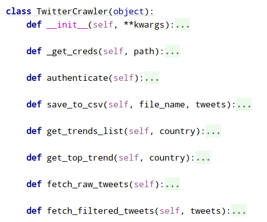
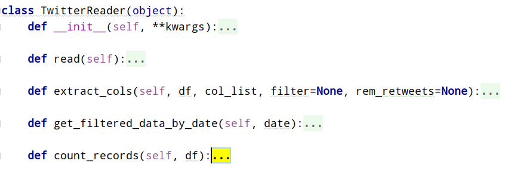
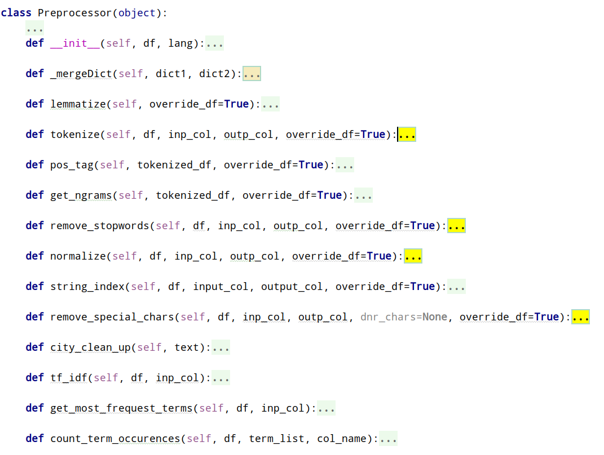

# Twitter Processor
A Spark application to read twitter data, preprocess it and output some useful statistics about it. It also does ML algorithms to do classification tasks. 

Several days worth of twitter data is available for download in the `Data` folder in the root of the repo. 

The project can currently do the following:

- Read huge json files with spark
- Fetch the right columns from it with spark
- preprocess the data (random order list)
    - normalize
    - stopword removal
    - special chars removal
    - tokenize
    - tf-idf (avail, but not used)

- Look up for the user-provided query. If query contains more than one word, only tweets containing all the words are stored in the output file
- Store the results into an output csv file of format
- Fetch the trending topics for each day and then get the top trends
    - Then preprocess and get tweet count per trend
- Compute slopes
- Plot each trend in it's own diagram

```csv
term,date,count
cat,2012-01-08,1138
cat,2012-01-07,135
```

### NB!
The project would not work in the most accurate way because the data is very old. Newest date available is `2012-01-08` and also because all the tweets in the provided twiter_file (the biggest one `twitter-sample.json`) are in `Dutch` language, not in `English`. Therefore some adjustments were made to part of the methods.

# The project currently lacks the following:

#### Primary
- __extensive__ unit testing, it only has a few test cases due to lack of time to implement the rest

#### Secondary
- dockerization

The project has functionality, but not integrated for:
- Fetching your own latest data by providing a json config file of the following syntax in the `vault/` directory. The whole folder as well as the data folder are part of `.gitignore`:
```shell
{
    "ACCESS_TOKEN": "xxxxxxxxx",
    "ACCESS_TOKEN_SECRET": "xxxxxxxxx",
    "API_KEY": "xxxxxxxxx",
    "API_SECRET_KEY": "xxxxxxxxx"
}
```

### App process

### Diagrams




-----------

# Run:
Please ensure you add `twitter-sample.json` inside the `data/TwitterData/` directory

```shell
pip install -r requirements.txt
python main.py
```

__NB!__ Running `main.py` will start asking for input. If you get annoyed, uncomment the `settings` in the `__main__`, add your values there and comment out the prompt function.

--------------------